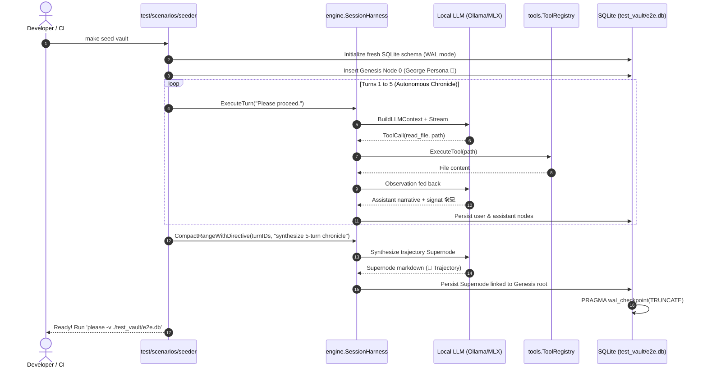

# ADR 015: End-to-End (E2E) Living Scenarios, Seeded Database Fixtures, and Test Subsystem Repatriation

## Status

Accepted

---

## Context

In the development lifecycle of `please`, verifying autonomous agent behavior requires navigating complex, multi-tiered feedback loops: Directed Acyclic Graph (DAG) state transitions, streaming token and thought demultiplexing, tool execution with security sandboxing, signat posture extraction, and Supernode trajectory compaction ([ADR 002](002-graph-sqlite-storage.md), [ADR 005](005-modular-tools-extraction.md), [ADR 010](010-pure-dag-graph-extraction.md)).

To validate these integrated mechanics against local model backends (Ollama, MLX, llama.cpp) and frontier cloud APIs, an integration suite was created in [`internal/engine/llm_test.go`](../internal/engine/llm_test.go).

Over successive architectural refactors, [`internal/engine/llm_test.go`](../internal/engine/llm_test.go) expanded into an **807-line monolith**, burdened by conflicting responsibilities. At the same time, earlier package extractions (ADRs 005, 008, 009, 010) left behind stranded unit tests, ghost mock methods, and untested bridging adapters across [`internal/engine`](../internal/engine/).

Crucially, `llm_test.go` also became the home for an indispensable development ritual: **an automated end-to-end loop starring "George the Archivist 🦉" that explores the workspace, invokes tools, synthesizes a compacted milestone Supernode, and leaves behind a living SQLite database (`test_vault/e2e.db`) for immediate visual inspection in the TUI.**

This document establishes a clean testing taxonomy, formally retires the militaristic "livefire" nomenclature in favor of **End-to-End (E2E)**, repatriates stranded tests to their proper domain homes, and promotes the living showcase scenario to a dedicated, first-class tool.

---

## Retiring "Livefire" in Favor of End-to-End (E2E)

The term *livefire* was originally adopted as a visceral shorthand for tests that fire prompts against active local GPU or cloud API backends rather than hermetic unit mocks. 

Upon architectural reflection, this term carries unwanted baggage:
1. **Ambiguous Scope**: *Livefire* sounds like an operational stress-test or chaos engineering exercise rather than a deterministic integration test.
2. **Cognitive Regret**: It does not communicate what the software is actually doing: exercising the complete system **end-to-end (E2E)** across CLI, engine, storage, tools, and providers.
3. **Ecosystem Misalignment**: Standard Go and industry toolchains recognize `e2e` and `integration` as conventional build tags, directory structures, and Makefile targets.

**Decision**: All references to `livefire` are deprecated and replaced with **End-to-End (E2E)**:
- `PLEASE_LIVE_FIRE=1` $\rightarrow$ `PLEASE_E2E=1` (and `//go:build e2e`)
- `make test-livefire` $\rightarrow$ `make test-e2e` (with `test-livefire: test-e2e` retained as a transition alias)
- `livefire.json` $\rightarrow$ `e2e.json`
- `test_vault/livefire.db` $\rightarrow$ `test_vault/e2e.db`
- Automatic CLI vault fallback candidate list in `cmd/please/memory.go` expands to check:
  `[]string{"test_vault/e2e.db", "vault.db", "e2e.db", "test_vault/livefire.db", "livefire.db"}`

---

## The Problem Statement

Our evaluation of repository shape reveals two distinct categories of technical debt: **monolithic conflation in `llm_test.go`**, and **stranded tests/interfaces left behind during previous modular extractions**.

### 1. The Quadruple Identity of `llm_test.go`
[`internal/engine/llm_test.go`](../internal/engine/llm_test.go) currently binds four mutually antagonistic concerns into one 807-line file:

1. **Custom Procedural Simulation Runtime (Lines 1–332)**: Hand-rolled turn runners ([`executeAutonomousTurn`](../internal/engine/llm_test.go), [`executeToolTurn`](../internal/engine/llm_test.go), `setupLiveFire`) that mimic Bubbletea and daemon event pumps in test code without exercising the canonical [`SessionHarness`](../internal/engine/harness.go).
2. **E2E Canary Probes (Lines 333–540)**: Smoke checks verifying that local or remote providers complete basic handshakes ([`TestLLM_Narrator`](../internal/engine/llm_test.go)) and emit structured tool invocations ([`TestLLM_ToolExecution`](../internal/engine/llm_test.go)).
3. **The Living Showcase / Scenario Seeder (Lines 541–600)**: [`TestLLM_AutonomousNarrativeVector`](../internal/engine/llm_test.go)—a 5-turn autonomous journey where George explores the workspace, inspects core files, records signat postures, and compacts into a milestone Supernode.
4. **Monolithic Unit Test Relics (Lines 601–807)**: Pure hermetic unit tests verifying configuration serialization ([`TestConfig_OptionsSerialization`](../internal/engine/llm_test.go)), config directory isolation ([`TestConfig_SaveAndLoad_Isolation`](../internal/engine/llm_test.go)), workspace path resolution ([`TestConfig_WorkspaceDir`](../internal/engine/llm_test.go)), and tool sandbox scoping ([`TestToolDefaults_WorkspaceScoping`](../internal/engine/llm_test.go)).

### 2. Destructive Fixture Annihilation
The setup routine in `llm_test.go` aggressively deletes database files:
```go
os.Remove(dbPath)
os.Remove(dbPath + "-wal")
os.Remove(dbPath + "-shm")
```
Because `TestLLM_Narrator`, `TestLLM_ToolExecution`, and `TestLLM_AutonomousNarrativeVector` all invoke this helper sequentially against the same database path:
- `TestLLM_Narrator` writes a handshake database.
- `TestLLM_ToolExecution` immediately deletes it to write a tool database.
- `TestLLM_AutonomousNarrativeVector` deletes *that* to write the George vector.

If an engineer runs `go test -run TestLLM_ToolExecution`, the George chronicle is destroyed. The desired outcome—a durable, seeded test vault for exploratory TUI inspection—is fragile, order-dependent, and constantly wiped by unrelated test runs.

### 3. Stranded Tests and Interface Gaps from Previous Refactors

| Defect / Debt Area | File / Location | Root Cause | Impact |
| :--- | :--- | :--- | :--- |
| **Stranded Config Tests** | [`internal/engine/llm_test.go:L601-728`](../internal/engine/llm_test.go) | Left behind when [`internal/config`](../internal/config) was extracted (ADR 008). | `go test ./internal/config` misses 120 lines of serialization and isolation coverage. |
| **Stranded Tool Sandbox Tests** | [`internal/engine/llm_test.go:L730-806`](../internal/engine/llm_test.go) | Left behind when [`internal/tools`](../internal/tools) was extracted (ADR 005). | Workspace boundary & traversal checks do not run with `go test ./internal/tools`. |
| **Stranded Graph Stress Test** | [`internal/engine/stress_test.go`](../internal/engine/stress_test.go) | Left behind when [`internal/graph`](../internal/graph) was extracted (ADR 010). | `internal/graph` has 0 concurrency tests; engine carries 80 lines of pure DAG thread-safety testing. |
| **Untested Memory Adapter** | [`internal/engine/memory_adapter.go`](../internal/engine/memory_adapter.go) | Bridged split `storage.MemoryStore` and `tools.MemoryStore` (ADR 014). | 145 lines of mapping, filtering, and diagnostic conversion have **zero** unit tests. |
| **Ghost Methods on Test Mocks** | [`internal/engine/service_test.go:L87-88`](../internal/engine/service_test.go) | Monolithic storage interface relics (`Close()`, `Vacuum()`). | Dead code on `MockStorage`; does not match modern `storage.Storage` interface. |
| **Shallow Alias Tests** | `engine/graph_test.go`, `storage_test.go`, `config_test.go` | Added to assert Go type aliases after extractions. | 220+ lines testing only that type aliases compile and forward. |
| **TUI Dual-Execution Divergence** | [`internal/tui/streaming.go:L110-345`](../internal/tui/streaming.go) | Manual streaming retained as fallback when `LocalHarnessProvider` was added (ADR 007). | `tui_test.go` tests the legacy fallback loop, while production runs through `SessionHarness`. |

---

## Decision: Architectural Synthesis

We establish a clean, three-tiered testing and fixture taxonomy:

```
┌────────────────────────────────────────────────────────────────────────┐
│                        Testing Taxonomy in Please                      │
├────────────────────────┬────────────────────────┬──────────────────────┤
│ 1. Hermetic Unit Tests │ 2. E2E Canary Probes   │ 3. Living E2E Seeders│
├────────────────────────┼────────────────────────┼──────────────────────┤
│ • go test ./...        │ • make test-canary     │ • make seed-vault    │
│ • Sub-second execution │ • Hardware/API smoke   │ • Full agent journeys│
│ • In-memory / TempDir  │ • Tag: //go:build e2e  │ • George the 🦉 seed │
│ • Lives in domain pkgs │ • Ephemeral DBs        │ • Durable test vault │
└────────────────────────┴────────────────────────┴──────────────────────┘
```

### 1. Repatriate Stranded Tests to Their Proper Packages
1. **Config**: Move `TestConfig_OptionsSerialization`, `TestConfig_SaveAndLoad_Isolation`, and `TestConfig_WorkspaceDir` from `llm_test.go` into [`internal/config/config_test.go`](../internal/config/config_test.go).
2. **Tools**: Move `TestToolDefaults_WorkspaceScoping` from `llm_test.go` into [`internal/tools/sandbox_test.go`](../internal/tools/sandbox_test.go).
3. **Graph**: Move `TestGraph_ConcurrencyStress` from [`internal/engine/stress_test.go`](../internal/engine/stress_test.go) into [`internal/graph/stress_test.go`](../internal/graph/). Delete `stress_test.go` from `engine`.
4. **Adapter Testing**: Create [`internal/engine/memory_adapter_test.go`](../internal/engine/) to provide 100% unit coverage for `NewMemoryToolsAdapter` bidirectional conversions.
5. **Mock Cleanup**: Remove orphaned `Close()` and `Vacuum()` declarations from `MockStorage` in [`internal/engine/service_test.go`](../internal/engine/service_test.go).

### 2. Extract E2E Canary Probes into `test/e2e/`
Create a dedicated `test/e2e/` package protected by the `//go:build e2e` constraint:
- Port `TestLLM_Narrator` and `TestLLM_ToolExecution` to `test/e2e/canary_test.go`.
- Ensure canary tests execute against hermetic, ephemeral databases using `t.TempDir()`, preventing interference with living fixture vaults.

### 3. Elevate "George the Archivist" to a First-Class Living Fixture Seeder
The 5-turn autonomous journey and Supernode compaction are promoted to a dedicated living scenario fixture:
- **Automated Regression Verification**: `test/scenarios/archivist_test.go` (asserts that the journey and milestone compaction complete with 100% fidelity).
- **Interactive Developer Seeder**: `test/scenarios/seeder/main.go`, invoked via `make seed-vault`.
- **Target Fixture**: Always writes directly to `./test_vault/e2e.db` (and checkpoints the WAL), leaving the database intact for inspection:
  ```bash
  please -v ./test_vault/e2e.db
  ```

---

## Detailed Design

### Directory Structure After Decomposition

```
please/
├── internal/
│   ├── config/
│   │   ├── config.go
│   │   └── config_test.go           <-- Absorbs TestConfig_* from llm_test.go
│   ├── graph/
│   │   ├── graph.go
│   │   ├── graph_test.go
│   │   └── stress_test.go           <-- Absorbs TestGraph_ConcurrencyStress
│   ├── tools/
│   │   ├── sandbox.go
│   │   └── sandbox_test.go         <-- Absorbs TestToolDefaults_WorkspaceScoping
│   └── engine/
│       ├── harness.go
│       ├── harness_test.go
│       ├── memory_adapter.go
│       ├── memory_adapter_test.go   <-- New: comprehensive adapter unit tests
│       └── service_test.go          <-- Cleaned: Close() and Vacuum() removed
└── test/
    ├── e2e/
    │   ├── common_test.go           <-- //go:build e2e: shared harness/provider setup
    │   └── canary_test.go           <-- //go:build e2e: fast narrator & tool checks
    └── scenarios/
        ├── archivist_test.go        <-- //go:build e2e: George the Archivist test
        └── seeder/
            └── main.go              <-- Runnable CLI: make seed-vault
```

### Canonical Scenario Architecture (George the Archivist 🦉)



### Updated Makefile Workflow

```makefile
.PHONY: test test-e2e test-canary seed-vault

# 1. Fast, hermetic unit tests (<1s, no GPU/network required)
test:
	go test ./...

# 2. Fast E2E canary probe checks (Ollama/OpenAI smoke tests)
test-canary:
	PLEASE_E2E=1 go test -v -tags=e2e -timeout 10m ./test/e2e/...

# 3. Seed a living, compacted database for manual TUI exploration
seed-vault:
	go run ./test/scenarios/seeder -vault ./test_vault/e2e.db -config ./e2e.json

# 4. Full End-to-End test suite (Canary + George Archivist Scenario)
test-e2e: test-canary
	PLEASE_E2E=1 go test -v -tags=e2e -timeout 30m ./test/scenarios/...

# 5. Backwards-compatibility transition alias
test-livefire: test-e2e
```

---

## Migration Plan

### Step 1: Repatriate Stranded Unit & Stress Tests
1. Transfer `TestConfig_OptionsSerialization`, `TestConfig_SaveAndLoad_Isolation`, and `TestConfig_WorkspaceDir` from [`internal/engine/llm_test.go`](../internal/engine/llm_test.go) into [`internal/config/config_test.go`](../internal/config/config_test.go).
2. Transfer `TestToolDefaults_WorkspaceScoping` into [`internal/tools/sandbox_test.go`](../internal/tools/sandbox_test.go).
3. Move [`internal/engine/stress_test.go`](../internal/engine/stress_test.go) to [`internal/graph/stress_test.go`](../internal/graph/).
4. Create [`internal/engine/memory_adapter_test.go`](../internal/engine/) covering `NewMemoryToolsAdapter`.
5. Remove `Close()` and `Vacuum()` from `MockStorage` in [`internal/engine/service_test.go`](../internal/engine/service_test.go).
6. Verify all domain tests pass: `go test ./internal/config ./internal/tools ./internal/graph ./internal/engine`.

### Step 2: Extract Canary Probes to `test/e2e/`
1. Create `test/e2e/common_test.go` and `test/e2e/canary_test.go` with the `//go:build e2e` tag.
2. Port `TestLLM_Narrator` and `TestLLM_ToolExecution` using `t.TempDir()`.

### Step 3: Implement `test/scenarios/` and `make seed-vault`
1. Create `test/scenarios/archivist_test.go` and `test/scenarios/seeder/main.go`.
2. Target output to `./test_vault/e2e.db` with clean terminal progress logging.
3. Wire the new targets into `Makefile`.

### Step 4: Deprecate and Remove `internal/engine/llm_test.go`
Delete the 807-line monolith once the E2E suite and repatriated tests are verified.

---

## Consequences

### Positive
- **Clear Engineering Nomenclature**: Replaces ambiguous "livefire" terminology with industry-standard "End-to-End (E2E)" and "Canary" naming.
- **Accurate Domain Testing**: Config tests live in `internal/config`; sandbox tests live in `internal/tools`; DAG concurrency tests live in `internal/graph`.
- **Durable Living Showcase**: `test_vault/e2e.db` is generated intentionally on-demand without fear of being stomped by smoke tests.
- **Hermetic Build Speed**: `go test ./...` remains sub-second fast because E2E tests require `-tags=e2e` or `make test-e2e`.
- **Dogfooding Canonical Primitives**: The seeder runs `engine.SessionHarness` directly, validating the identical code path used by the TUI, daemon, and ACP.

### Negative / Neutral
- Deprecates existing `livefire.json` in favor of `e2e.json` (supported transparently via configuration migration).
- Requires updating developer muscle memory from `make test-livefire` to `make test-e2e` and `make seed-vault`.
