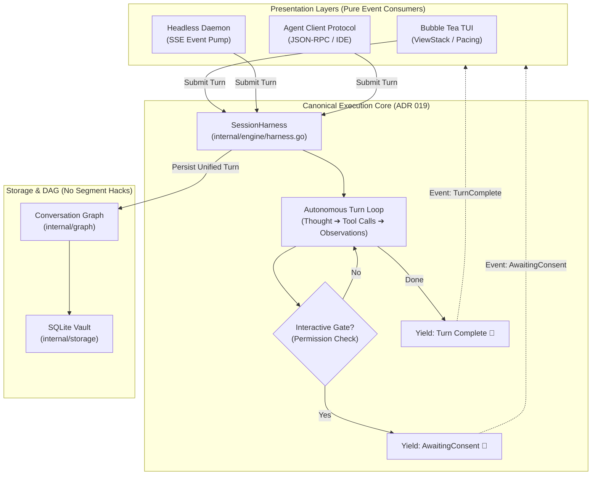

# ADR 019: Execution Lifecycle Convergence and Canonical Harness Standardization

## Status

Accepted

---

## Context

In [ADR 007 (Phase 2+)](007-multi-session-daemon-branch-concurrency.md), `please` introduced `SessionHarness` (`internal/engine/harness.go`) to resolve the multi-state machine tension that arose during daemon streaming development. `SessionHarness` extracted the core multi-turn agent execution loop:

$$\text{BuildLLMContext} \longrightarrow \text{GenerateResponseStream} \longrightarrow \text{ExecuteToolCall} \longrightarrow \text{UpdateAssistantObservations} \longrightarrow \text{SaveSessionHead}$$

This canonical harness cleanly emits typed asynchronous events (`token`, `thought`, `tool_call`, `tool_result`, `node_complete`, `error`) over an event channel, enabling the headless daemon's `SessionActor` to process concurrent sessions with single-threaded stability.

### The Problem: Divergent Execution Wheels
Despite `SessionHarness` existing as the canonical execution runner, the interactive Terminal User Interface (`internal/tui/`) continues to maintain its own parallel, legacy tool-dispatching and streaming machinery:
1. **Parallel Tool Dispatching**: `internal/tui/tools_handlers.go` runs its own `executeToolsCmd` and `cancelToolsCmd` loops over `PendingToolCalls`, calling `m.Manager.ExecuteToolCall` and mutating `m.Manager.UpdateAssistantObservations` directly from Bubble Tea commands.
2. **Duplicated In-Flight State**: The TUI `Model` tracks ephemeral execution state—`InterleavingNodeID`, `PendingToolCalls`, and intermediate pacing buffers—independently of the engine harness.
3. **Metadata Segment Hacking**: To reconstruct multi-hop tool execution during streaming, assistant turns were saving JSON-serialized slices into `node.Metadata["segments"]`, creating synthetic text fragmentation alongside `node.Observations` and lingering `RoleTool` node paths.
4. **Phonic Staging Fragility**: Managing terminal bell triggers (`\a`) across both `streaming.go` and `harness.go` created subtle timing risks where permission gates and turn conclusions could be desynchronized.

Attempting to invent a brand new domain entity (such as a heavy `Step` struct) to model these intermediate hops would add needless complexity. The fundamental unit of interaction has always been the **Conversational Turn**. What the codebase lacks is not a new noun, but **single-pipeline convergence**.

---

## Decision

We formally consolidate all execution across `please` onto the canonical `SessionHarness`, transforming presentation layers into pure, reactive consumers.

### 1. The Conversational Turn as the Singular Unit of Reality
* A **Turn** begins when an actor submits input (`RoleUser`).
* A Turn concludes when the model yields control back to the human (`TurnComplete` or terminal error).
* Intermediate cognitive hops (thoughts, tool invocations, and observations) are internal mechanics of that single Turn. No separate `Step` domain entity is introduced.
* Autonomous looping within a turn is bounded strictly by a configurable `max_steps` budget (retiring the ambiguous `maxDepth` parameter).

### 2. Retiring Redundant TUI Dispatch Machinery
* **Delete `executeToolsCmd` & `cancelToolsCmd`** in `internal/tui/tools_handlers.go`.
* **Remove `PendingToolCalls` and `InterleavingNodeID`** from `internal/tui/model.go`.
* The interactive TUI interacts with the engine strictly through `LocalHarnessProvider` (`internal/engine/local_provider.go`), mirroring the remote daemon's SSE client bit-for-bit.
* When the harness emits `HarnessEventToolCall`, the TUI updates its visual display. If the tool requires permission, the harness pauses at `AwaitingConsent`, prompting the TUI to push `confirm_tool` onto the ViewStack.

### 3. Unified Phonic Staging (The Yield Invariant)
Acoustic terminal bells (ASCII `0x07` / `\a`) per [ADR 013](013-acoustic-theatrics-phonic-staging-and-talon-tap-telemetry.md) fire strictly upon the state transition:

$$\text{State}_{\text{Active}} \longrightarrow \text{State}_{\text{AwaitingUserInput}}$$

This transition occurs under exactly two conditions:
1. **Interactive Yield (`AwaitingConsent`)**: The model paused mid-turn at a permission gate requiring human approval.
2. **Terminal Yield (`Completed`)**: The model completed its response, executed all necessary tools, and yielded the floor back to the user prompt.

Intermediate autonomous tool loops remain completely silent.

### 4. Elimination of Metadata Segment Hacking
* Assistant turns in the DAG (`graph.Node`) cleanly represent the complete turn.
* In-flight JSON serialization to `node.Metadata["segments"]` is deprecated and removed.
* Tool calls (`node.ToolCalls`) and observations (`node.Observations`) are indexed and paired deterministically by `ToolCallID`, guaranteeing order and provenance without string-splitting hacks.

---

## Consequences

### Positive
* **Single Authoritative Pipeline**: There is exactly **one** code path that executes tools and loops models in the entire repository (`SessionHarness`).
* **Zero Presentation Drift**: Bug fixes, timeout handling, sandboxing checks, and security gates applied to `SessionHarness` automatically apply equally to standalone `please`, `please connect`, `please serve`, and `please acp`.
* **Simpler Mental Model**: Eliminates three parallel state machines, making the execution flow predictable and approachable for local model pair programming.
* **Stable Foundation for ADR 020**: Decouples execution completely from prompt formatting, allowing `ContextShaper` to be developed as a pure mathematical projection.

### Negative / Risks
* **TUI Streaming Refactor**: Requires updating `internal/tui/streaming.go` to ensure natural reading pacing unwinds cleanly from the harness event stream without dropped runes.
* **Migration Verification**: Existing nodes containing legacy `metadata["segments"]` must be safely loaded by `BuildLLMContext` during the transition without regressions.

---

## Verification & Living Scenarios

Conforming to [ADR 015](015-living-scenarios-and-test-subsystem-decomposition.md), this convergence must be verified via:
1. **Hermetic Test Suite**: `go test -count=1 ./...` completes in `< 2s` with 100% passage across all packages.
2. **Living Scenarios**: E2E multi-turn tool calling validated in `internal/engine/scenarios_test.go` and `internal/server/server_test.go`.
3. **Interactive Manual Sanity**: Standalone TUI (`go run ./cmd/please`) verified against multi-tool loops with permission gating (`SandboxPolicyStandard`) and terminal bell acoustics.
