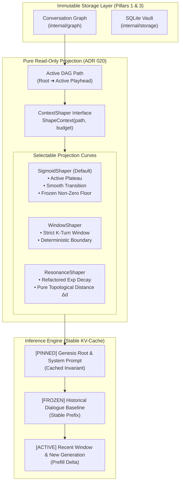

# ADR 020: Cache-Stable Context Shaping, Monotonic Prefix Invariance, and Pure Prompt Projections

## Status

Proposed

---

## Context

In early versions of `please`, prompt construction was managed directly inside `internal/engine/service.go` (`BuildLLMContext`) using an exponential **Context Resonance Scoring** algorithm ([docs/context_resonance.md](../docs/context_resonance.md)):

$$V = (W \cdot C) \cdot e^{-k \cdot \Delta t}$$

The formula was designed to combat context exhaustion by scaling to the model's configured context window (`num_ctx`), decaying older nodes as conversational distance and elapsed time increased.

While this mechanism prevented out-of-memory crashes on small models, prolonged daily usage across local inference engines (Ollama, llama.cpp, vLLM) revealed three fundamental architectural flaws:

### 1. The Wall-Clock Flaw ("Lunch Break Amnesia")
The temporal factor $\Delta t = \text{time.Since(node.Timestamp).Minutes()}$ tied prompt inclusion to real-world clock ticks. 
* If a developer spends 10 minutes establishing an architectural plan and then steps away for a 45-minute lunch, $\Delta t$ ticks from 10 to 55 minutes.
* Upon returning, zero additional tokens have been generated and zero tool calls have run. Yet because the clock advanced, the resonance score plummeted, causing the engine to aggressively prune or truncate the foundational requirements just agreed upon.
* Computational state in a conversational DAG must depend on **causal progression**, not human idle time.

### 2. The "Shivering Token" KV-Cache Invalidation
Modern LLM inference engines rely heavily on **KV-cache prefix matching**:
* If token prefix $0 \dots M$ remains identical character-for-character across consecutive requests, the engine skips attention recalculation, reducing prompt prefill time from seconds to milliseconds.
* Because $\Delta t$ and floating-point resonance scores shifted continuously, older historical nodes were re-truncated to slightly different character offsets on almost every turn.
* These "shivering tokens" invalidated the prefix cache at early positions, forcing the GPU to re-compute the entire prompt from scratch on every turn. This made local inference on laptops feel sluggish and heavy.

### 3. Symmetric Decay on Asymmetric Data
The formula applied a single exponential curve uniformly across both **sensory telemetry** (tool results) and **spoken dialogue** (`node.Content`):
* Tool observations are high-volume, low half-life sensory data. When a tool reads a 50 KB file or runs a build command, that output is vital for the immediate next turn, but its relevance drops sharply once the task advances.
* Spoken dialogue contains foundational requirements, constraints, and user steering. Decaying dialogue exponentially causes the model to lose its original grounding ("goal drift").

---

## Decision

We decouple prompt context assembly from storage by introducing the `ContextShaper` interface—a **pure, read-only projection** governed by **Monotonic Prefix Invariance** and **causal topological distance**.



### 1. Pure Read-Only Projection Invariant
* `ContextShaper` is strictly a mathematical projection:
  $$\text{DAG Path} \times \text{Token Budget} \longrightarrow \text{Prompt Messages}$$
* A shaper **must never mutate the DAG**, modify node fields in memory, or write to SQLite.
* Compaction (Supernodes & memory harvesting) remains an explicit graph lifecycle event (ADR 021). Shapers project whatever nodes are present in the path with zero side effects.

### 2. The `ContextShaper` Interface
We extract prompt shaping out of `service.go` into a dedicated domain contract:

```go
package engine

import (
	"context"
	"github.com/bartkleypas/please/internal/domain"
	"github.com/bartkleypas/please/internal/graph"
)

// ContextShaper formats and filters an active DAG path into a cache-stable prompt sequence.
type ContextShaper interface {
	ShapeContext(ctx context.Context, path []*graph.Node, budget int) ([]domain.Message, error)
}
```

### 3. Elimination of Wall-Clock Decay
* Wall-clock calculations (`time.Since`, `deltaMinutes`) are completely eliminated from context shaping.
* Shapers evaluate relevance strictly through:
  1. **Topological Turn Distance ($\Delta d$)**: The number of conversational turns separating a node from the active leaf.
  2. **Capacity Pressure (Fill Ratio)**: The active path's estimated token load relative to the model's configured context budget (`num_ctx`). If the session consumes $< 60\%$ of context, all nodes retain full fidelity.

### 4. Monotonic Prefix Invariance (The KV-Cache Contract)
To guarantee optimal prompt prefill reuse on local inference engines:
1. **PINNED Genesis Root**: The system prompt (`RoleSystem`) and the initial user goal turn are pinned at 100% full fidelity. Token prefix $0 \dots N$ is invariant.
2. **The Frozen Asymptote (Stable Floor)**: As historical nodes age past the active working window, they settle onto a discrete, deterministic baseline representation. **Once a node hits this floor, its rendered text is immutable.** It never shrinks by further characters on subsequent turns, keeping the prefix token sequence valid in the inference engine's cache.
3. **Active Working Window**: Only the newest turns at the tail of the DAG mutate, ensuring that only new tokens are prefilled by the inference engine.

### 5. Standard Implementations

Configurable via `ClientConfig` / `ServerConfig` (`context_shaper: "sigmoid" | "window" | "exponential"`):

#### 1. `SigmoidShaper` (Recommended Default)
* Applies a logistic S-curve to historical dialogue:
  $$S(d) = \frac{1}{1 + e^{k(d - d_0)}}$$
* **Active Plateau ($d < d_0$)**: Recent turns (default: last 6 turns) remain in 100% full fidelity.
* **Smooth Transition**: Older turns gently roll off without abrupt sliding-window cliffs.
* **Stable Floor**: Ancestor nodes asymptote to a deterministic baseline summary or receipt rather than decaying to zero, preserving foundational grounding.

#### 2. `WindowShaper`
* Strict $K$-turn sliding window (e.g. last 10 turns + pinned genesis root).
* Predictable, zero-math, and provides 100% deterministic prefix cache lines; ideal for resource-constrained local models with small context windows (8k–16k).

#### 3. `ResonanceShaper` (Legacy Refactored)
* The original Context Resonance formula, refactored to eliminate wall-clock decay:
  $$V = (W \cdot C) \cdot e^{-k_d \cdot \Delta d}$$
* Retains dynamic capacity pressure zones (`fillRatio < 60%`, `60%–85%`, `> 85%`) while guaranteeing determinism.

---

## Consequences

### Positive
* **Rock-Solid KV-Cache Reuse**: Eliminates token shivering. Prefill times on local models remain near-instant across long conversational branches.
* **Immunity to Lunch-Break Amnesia**: Leaving a session idle overnight or stepping away for lunch has zero impact on conversational recall.
* **Separation of Concerns**: Decouples the mathematical projection of prompts from database storage and execution loops.
* **Pluggable Experimentation**: Developers can benchmark different shaping strategies by changing a single configuration key (`context_shaper`).

### Negative / Risks
* **Tuning Inflection Points**: The sigmoid slope $k$ and inflection offset $d_0$ must be calibrated with sensible defaults relative to `num_ctx`.
* **Token Estimation**: Estimating token counts without a native BPE tokenizer requires reliable character-to-token ratio heuristics (defaulting to 3.8 chars/token).

---

## Verification & Living Scenarios

1. **Hermetic Determinism Tests**: Unit tests in `internal/engine/shaper_test.go` asserting that given identical DAG paths, `ShapeContext` outputs byte-for-byte identical prompt slices regardless of real-world elapsed time.
2. **Monotonic Prefix Tests**: Verify that as new turns are appended to a 10-turn DAG path, the rendered token text of turns $0 \dots 5$ does not change.
3. **Local Benchmark Validation**: Verify with `please` running against local Ollama (`gemma4:12b` / `31b`) that prefill durations on turn 10 do not re-evaluate historical tokens.
