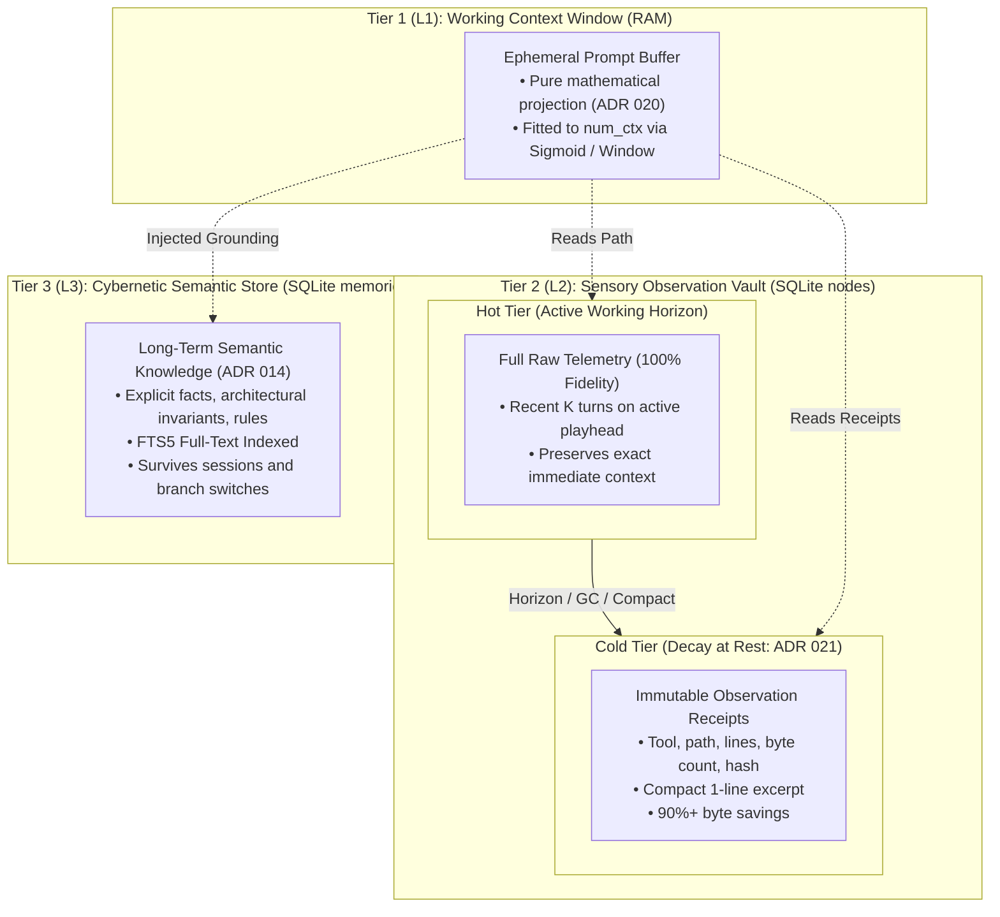

# ADR 021: Tiered Sensory Storage, Observation Compaction, and Vault Hygiene

## Status

Proposed

---

## Context

In early versions of `please`, whenever a tool executed—whether reading a 50 KB source file via `read_file` or running a verbose build command via `execute_command`—the complete, raw standard output was written directly into the `observations` JSON column of the SQLite `nodes` table.

While this ensured complete auditability, prolonged operational usage revealed an inverted memory paradox: **the vault was keeping a 1:1 duplicate copy of a temporary host filesystem state in an append-only relational database.**

### The Problem: Unbounded Sensory Bloat
1. **Database Vault Inflation**: In an operating system, the disk is the source of truth, and RAM holds transient page buffers. The OS never tattoos every page read into a permanent database. In `please`, a 20-turn session inspecting and editing code routinely inflated `vault.db` to 20x–50x the size of the codebase being worked on.
2. **Stale Ghost Snapshots**: Storing 2,000 lines of file text from turn 3 serves no operational purpose on turn 15 after the file has already been edited or deleted on host disk. The prompt shaper ([ADR 020](020-cache-stable-context-shaping-and-pure-prompt-projections.md)) already reduces distant observations to 1-line skeletons; keeping megabytes of stale text on disk wastes storage, slows backups, and inflates WAL checkpoints.
3. **The Fragmented Memory Landscape**:
   * **Tier 1 (L1 - Working Context Window)** was formalized in ADR 020 as an ephemeral, read-only prompt projection.
   * **Tier 3 (L3 - Cybernetic Semantic Store)** was established in [ADR 014](014-persistent-agent-memory-and-cybernetic-recall.md) as the dedicated `memories` table with FTS5 search.
   * **Tier 2 (L2 - Sensory Observation Vault)** remained an unmanaged, append-only landfill with zero eviction or compaction policies.

---

## Decision

We formally establish the **Three-Tier Memory Architecture** and introduce **Observation Compaction (Decay at Rest)** in SQLite, evicting raw telemetry on distant ancestor nodes down to lightweight, immutable **Observation Receipts**.



### 1. The Three-Tier Memory Model Formalized

| Tier | Subsystem | Mutability & Lifecycle | Retention Policy | Primary Role |
| :--- | :--- | :--- | :--- | :--- |
| **L1** | In-Memory RAM | Reconstructed per generation; ephemeral | Discarded after turn completion | Working attention span fitted to `num_ctx`. |
| **L2** | SQLite `nodes.observations` | Tiered retention: Hot $\rightarrow$ Cold | **Decay at Rest**: Compaction to receipts | Operational audit trail and causal replay. |
| **L3** | SQLite `memories` table | Durable, explicit UPSERT, FTS5 indexed | Permanent until updated or deleted | Enduring project knowledge, constraints, preferences. |

### 2. Hot vs. Cold Sensory Tiering (Observation Receipts)
Sensory telemetry in the SQLite vault undergoes lifecycle transitions:

* **Hot Tier (Active Working Horizon)**:
  * Applies to the most recent $K$ turns (default: 3 turns) along the active branch path.
  * Retains 100% of the raw tool output string in `nodes.observations` so immediate next-step iterations have exact syntax and error telemetry.
* **Cold Tier (Ancestor Turns beyond Grace Horizon)**:
  * When a node falls past the working horizon, its raw payload in `nodes.observations` is replaced with an **Observation Receipt**:
    ```json
    {
      "tool_call_id": "call_12345",
      "tool": "read_file",
      "path": "internal/engine/service.go",
      "summary": "Read lines 1-250 (9.4 KB, hash: e3b0c442)",
      "bytes": 9420,
      "lines": 250,
      "retained_excerpt": "package engine\n\nimport (\n..."
    }
    ```
  * Receipts preserve provenance (what tool was called, what file was touched, line counts, and content hash) while shrinking storage by over 90%.
  * **Immutability Contract**: Once a raw observation is converted to a receipt, it is frozen forever. It never mutates across subsequent turns, preserving ADR 020's Monotonic Prefix Invariance for inference prefill.

### 3. Compaction Lifecycle Triggers
Observation compaction occurs through three complementary mechanisms:
1. **Maintenance Compaction (`please gc`)**:
   The garbage collection routine scans the conversation DAG, compacts all observations on nodes beyond the active session heads' grace horizon, and executes `VACUUM` to reclaim disk space.
2. **Explicit Turn Compaction (`/compact`)**:
   When a user triggers `/compact`, the existing `CompactRangeWithDirective` workflow creates a `RoleSummary` Supernode, harvests durable facts to L3 (`memories`), and compacts the underlying range's L2 observations to receipts.
3. **In-Flight Horizon Eviction**:
   On turn completion within `SessionHarness`, ancestor nodes exceeding the grace horizon ($d > d_{\text{grace}}$) are automatically flagged and compacted to receipts in SQLite.

### 4. Vault Encryption Compatibility
* Conforming to [ADR 009](009-modular-storage-extraction.md), Observation Receipts are encrypted with AES-256-GCM (`EncryptField`, prefixed with `enc:v1:`) when vault encryption is active.
* Encryption and decryption routines operate transparently on both legacy raw strings and structured receipt payloads.

---

## Consequences

### Positive
* **Drastic Vault Size Reduction**: Slashes `vault.db` and WAL file growth by 80%–90% during extended coding and research sessions.
* **Preserved Auditability**: Replay, `please inspect`, and causal diagnostics retain full provenance (tool name, path, line budget, content hash, and leading excerpt) without dead-weight payloads.
* **Synergy with ContextShaper (ADR 020)**: Shapers read frozen receipts directly from the vault, ensuring historical nodes are already compact before prompt assembly begins.
* **Clear Conceptual Separation**: Distinguishes transient perception (L2) from permanent semantic knowledge (L3).

### Negative / Risks
* **Irreversible Eviction of Raw Tool Bytes**: Once a cold observation is crushed into a receipt, the full raw compiler log or file text cannot be retrieved from the database (though the host file remains on disk).
* **Schema / Payload Migration**: `SQLiteStorage.LoadGraph` must gracefully handle both legacy raw JSON observation strings and structured receipt objects.

---

## Verification & Living Scenarios

1. **Storage Hermetic Tests**: Unit tests in `internal/storage/storage_test.go` verifying that `CompactNodeObservations` correctly generates receipts, updates the database, supports AES-GCM encryption, and survives `LoadGraph`.
2. **Byte Savings Diagnostics**: Verify with `please inspect` that node scorecard telemetry accurately reports raw byte sizes vs. compacted receipt sizes.
3. **Living Scenario Validation**: Run an E2E scenario in `internal/engine/scenarios_test.go` where an agent reads large files across 10 turns, verifying that `vault.db` stays compact and all tests pass with `< 2s` execution.
