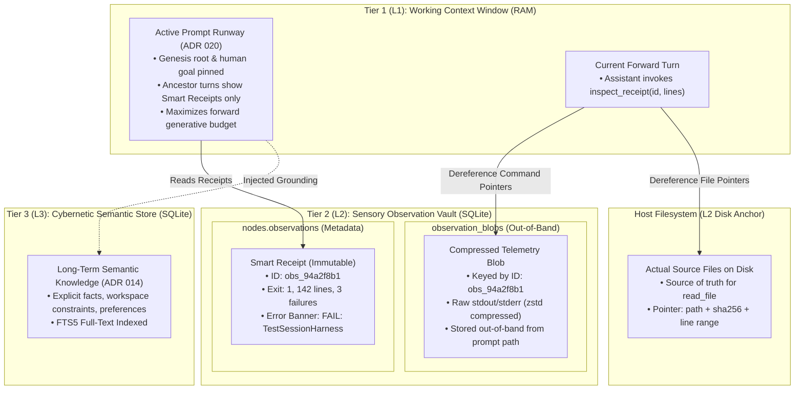

# ADR 021: Tiered Sensory Storage, Smart Receipts, and Addressable Observation Paging

## Status

Proposed

---

## Context

In early versions of `please`, whenever a tool executed—whether reading a 50 KB source file via `read_file` or running a verbose test suite via `execute_command`—the complete, raw standard output was written directly into the `observations` JSON column of the SQLite `nodes` table and immediately injected into subsequent prompt contexts.

This approach created an acute operational dilemma across extended engineering sessions:

### 1. The False Dilemma: In-Context Bloat vs. Irreversible Amnesia
* **If we keep full raw outputs forever**:
  * The context window drowns in historical telemetry. A single 200-line test failure or 800-line file read consumes thousands of tokens on every single subsequent turn.
  * For local models (e.g., Gemma 12B/27B) and subscription Flash models, this attention clutter dilutes reasoning density, exhausts generation runway, and triggers unnecessary prefill recomputations.
* **If we irreversibly delete or summarize away past outputs**:
  * The agent suffers from catastrophic amnesia. When debugging a tricky build failure across multiple iterations, the model frequently needs to inspect the exact line number, compiler flag, or stack trace from a command run three turns ago.
  * Once raw output is irreversibly destroyed, the agent is forced into redundant, wasteful re-execution loops.

### 2. The Storage Paradox (Disk Duplication vs. Ephemeral Loss)
* **Filesystem-Backed Reads (`read_file`)**: The host disk is the authoritative source of truth. Storing megabytes of verbatim file text in an append-only SQLite database duplicates the repository into the database, causing 20x–50x database inflation for data that already lives on disk.
* **Ephemeral Command Execution (`execute_command`)**: Unlike files, stdout and stderr from transient commands (test runners, curl requests, linters) do *not* exist on disk. If discarded immediately, they vanish forever.

---

## Decision

We establish the **Three-Tier Memory Architecture** and introduce **Virtual Memory Paging for Agent Context**:
1. In-context prompt sequences carry only compact, deterministic **Smart Receipts** containing a virtual pointer handle (`obs_<hash>`).
2. Raw tool telemetry is stored **out-of-band** in SQLite (`observation_blobs`) or backed directly by the host filesystem.
3. The agent is equipped with a native dereference tool (`inspect_receipt`) allowing it to page slices of historical telemetry back into its active forward pass on-demand.



---

### 1. The Three-Tier Memory Model Formalized

| Tier | Subsystem | Storage Mechanism | Retention Policy | Primary Role |
| :--- | :--- | :--- | :--- | :--- |
| **L1** | **Working Context Window** | Ephemeral RAM Buffer | Reconstructed per generation; ephemeral | High-density attention runway fitted to model `num_ctx`. |
| **L2** | **Sensory Observation Vault** | SQLite `nodes` + `observation_blobs` | Out-of-band blobs + in-DAG Smart Receipts | Complete causal audit trail and on-demand telemetry paging. |
| **L3** | **Cybernetic Semantic Store** | SQLite `memories` table | Durable, explicit UPSERT, FTS5 indexed | Permanent architectural facts, constraints, and project rules. |

---

### 2. The Smart Receipt Specification

Every tool observation recorded in `nodes.observations` conforms to the deterministic **Smart Receipt** contract:

```json
{
  "receipt_id": "obs_94a2f8b1",
  "tool": "execute_command",
  "command": "go test ./...",
  "exit_code": 1,
  "lines": 142,
  "bytes": 8420,
  "summary": "142 lines, 3 test failures",
  "banner": "FAIL: TestSessionHarness_Compaction (0.12s)",
  "has_blob": true
}
```

#### Receipt Fields & Guarantee:
* **`receipt_id`**: Deterministic content-addressable identifier (`obs_` + 8-char hex prefix of hash).
* **`tool` & `command`/`path`**: Concrete provenance of the action.
* **`summary` & `banner`**: High-signal, 1-line sensory summary (e.g. primary test failure, file read span, git status delta) providing immediate conversational grounding without reading full output.
* **Monotonic Immutability**: Once a receipt is committed to a node, its string representation never shifts, preserving **Monotonic Prefix Invariance** ([ADR 020](020-cache-stable-context-shaping-and-pure-prompt-projections.md)) for instant KV-cache prefill.

---

### 3. Out-of-Band Storage vs. Filesystem Backing

Telemetry is partitioned by reproducibility:

1. **Host Filesystem-Backed Telemetry (`read_file`, `write_file`)**:
   * Storing file bodies in SQLite is prohibited. The file exists on the host disk.
   * The receipt stores `path`, `line_start`, `line_end`, `byte_count`, and `sha256`.
   * If the model needs to re-read lines, the virtual pointer is dereferenced via the standard `read_file` tool.

2. **Ephemeral Execution Telemetry (`execute_command`)**:
   * Raw stdout and stderr are stored out-of-band in a dedicated SQLite table:
     ```sql
     CREATE TABLE IF NOT EXISTS observation_blobs (
         receipt_id TEXT PRIMARY KEY,
         node_id    TEXT NOT NULL REFERENCES nodes(id) ON DELETE CASCADE,
         created_at TEXT NOT NULL,
         tool       TEXT NOT NULL,
         compressed INTEGER NOT NULL DEFAULT 1,
         payload    BLOB NOT NULL
     );
     CREATE INDEX IF NOT EXISTS idx_obs_blobs_node ON observation_blobs(node_id);
     ```
   * Payloads are compressed using `zstd` or `gzip` before storage.
   * Prompt construction (`ContextShaper`) never queries `observation_blobs`; it only reads the lightweight `nodes.observations` receipts.

---

### 4. The Dereference Primitive: `inspect_receipt`

To bridge the gap between lean receipts and forensic verification, we introduce a standard sensory tool in the harness tool kit:

```json
{
  "name": "inspect_receipt",
  "description": "Inspects raw telemetry from a past tool observation receipt by its receipt_id. Use this when you need exact lines, error traces, or verbose output from an earlier command.",
  "parameters": {
    "type": "object",
    "properties": {
      "receipt_id": {
        "type": "string",
        "description": "The receipt ID to look up (e.g. 'obs_94a2f8b1')."
      },
      "start_line": {
        "type": "integer",
        "description": "Optional 1-indexed start line to page in."
      },
      "line_count": {
        "type": "integer",
        "description": "Optional number of lines to retrieve (default: 50, max: 200)."
      },
      "grep": {
        "type": "string",
        "description": "Optional regex pattern to filter lines from the raw output."
      }
    },
    "required": ["receipt_id"]
  }
}
```

#### Operational Workflow:
1. **Turn 2**: Assistant runs `execute_command("go test ./...")`. Output is 300 lines with 2 failures. The full 300 lines are stored in `observation_blobs("obs_94a2f8b1")`. In the DAG node, only the 1-line Smart Receipt is committed.
2. **Turn 3–6**: Assistant edits code, inspects files, and checks git status. During all these turns, `obs_94a2f8b1` costs less than 40 tokens in the prompt context.
3. **Turn 7**: Assistant needs to see the exact assertion failure on the second test. It calls:
   `inspect_receipt(receipt_id="obs_94a2f8b1", grep="FAIL:")`.
4. The harness dereferences the blob, retrieves only matching lines, and feeds them into the *current* turn's forward perception.
5. **Net Result**: 0 tokens wasted across Turns 3–6, 0 prefill cache churn, and 0 data loss.

---

### 5. Storage Hygiene and Blob Lifecycle

* **Session Lifetime**: All blobs created during an active session remain resident in `observation_blobs`.
* **Compaction / GC (`please gc`)**:
  * An automated or manual vacuum routine can prune out-of-band blobs older than a configurable horizon (e.g., 30 days or detached branches).
  * Pruning a blob leaves the node's `nodes.observations` receipt intact; if an agent subsequently attempts to inspect an evicted blob, `inspect_receipt` returns a graceful notice: `"Telemetry for obs_... has been pruned by vault retention policy."`
  * This ensures the conversation DAG never experiences broken foreign keys or corrupted replay graphs.

---

## Consequences

### Positive
* **Optimal Attention Runway**: Slashes context token consumption by 90%+ on tool-heavy sessions, keeping local Gemma and Flash models operating in their highest-fidelity attention sweet spot.
* **Elimination of the Amnesia Dilemma**: Complete command telemetry is preserved out-of-band in SQLite without burdening active prompt contexts.
* **Cache-Stable Prefill**: Receipts settle onto deterministic, immutable text representations immediately, satisfying ADR 020's Monotonic Prefix Invariance.
* **Zero Host Duplication**: Eliminates redundant SQLite duplication of host filesystem files.
* **Forensic Inspection**: Developers and automated diagnostics (`please inspect`) retain full ability to examine raw tool outputs on demand.

### Negative / Trade-offs
* **New Schema Table**: Introduces `observation_blobs` to the SQLite schema and requires standard migration handling in `storage.go`.
* **Tool Surface Expansion**: Adds one tool (`inspect_receipt`) to the model's tool kit. However, its sensory nature and descriptive contract make it immediately intuitive to modern instruction-tuned LLMs.

---

## Verification & Living Scenarios

1. **Storage Hermetic Tests**: Unit tests in `internal/storage/` verifying that `SaveObservationBlob` compresses payloads, `LoadObservationBlob` correctly handles line offsets and grep filtering, and `nodes.observations` stores valid receipts.
2. **Prompt Shaper Verification**: Verify that `ContextShaper` implementations (`sigmoid`, `window`) assemble prompts consisting solely of receipts for ancestor turns, maintaining identical prefix token counts across turns.
3. **Living Scenario Validation**: An end-to-end scenario in `internal/engine/scenarios_test.go` where an agent runs a verbose command, proceeds through multiple conversational turns, invokes `inspect_receipt` to retrieve a specific error snippet, and successfully resolves the task.
