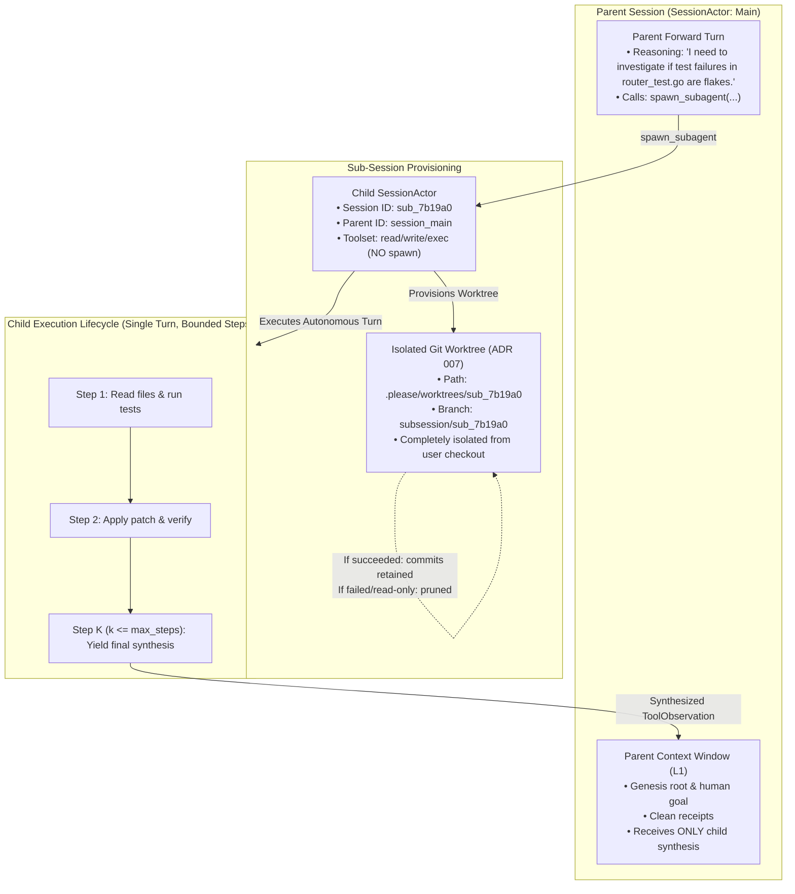

# ADR 022: Native Delegated Multi-Agent Topologies and Sub-Session Worktree Isolation

## Status

Proposed

---

## Context

As engineering tasks scale in complexity—such as hunting race conditions across dozens of files, exploring speculative refactors, or running slow performance benchmarks—a monolithic, single-agent conversation model quickly encounters severe failure modes:

### 1. Context Window Pollution & Attention Dilution
When a single agent performs deep exploratory research, every inspected file, exploratory shell command, and trial-and-error compilation failure enters the primary conversation history. By turn 10, the model's active attention window is drowned in intermediate noise. For local models (e.g. Gemma 12B/27B) and subscription Flash models, this noise degrades reasoning fidelity and rapidly exhausts generative token budgets.

### 2. Filesystem Contamination & Workspace Insecurity
Speculative edits or destructive experiments performed directly in the user's active repository checkout dirty the working tree. If an exploratory refactor or failed test run leaves stray files or broken builds, the human operator must manually restore their working tree.

### 3. The Fragility of Shell-Based Orchestration
Historically, running multiple agents in `please` required out-of-band shell scripts or CLI piping (`please exec ... | please ...`). External scripts:
* Lack parent-child DAG tracking and causal auditability.
* Risk filesystem write races and corrupted git index locks when touching the same repository concurrently.
* Cannot safely share or scope L3 persistent memories ([ADR 014](014-persistent-agent-memory-and-cybernetic-recall.md)).
* Cannot return structured sensory observations back into the parent agent's reasoning loop.

---

## Decision

We establish **Native Delegated Multi-Agent Topologies** as a first-class internal engine capability:
1. The parent agent delegates discrete sub-tasks using a native tool: `spawn_subagent`.
2. The daemon provisions a dedicated child [`SessionActor`](../internal/server/session_actor.go) operating within an isolated Git worktree ([ADR 007](007-multi-session-daemon-branch-concurrency.md)).
3. Child sessions execute under a strict **Single Turn, Bounded Steps** lifecycle, returning only a high-level **Synthesized Observation** back to the parent.
4. Intermediate child trial-and-error noise is kept strictly out of the parent's DAG context window.
5. Maximum delegation depth is strictly capped at 1 (preventing recursive fork-bombs).



---

### 1. The Delegation Tool Contract (`spawn_subagent`)

The parent agent invokes subagents via a dedicated tool registered in `internal/tools/delegate.go`:

```json
{
  "name": "spawn_subagent",
  "description": "Spawns an isolated child subagent to perform a focused investigation, exploratory refactor, or test suite run. The subagent runs in a dedicated workspace and returns a synthesized summary back to you.",
  "parameters": {
    "type": "object",
    "properties": {
      "task": {
        "type": "string",
        "description": "Clear natural language objective for the subagent."
      },
      "session_label": {
        "type": "string",
        "description": "Descriptive label for the sub-session (e.g. 'audit-auth-race-conditions')."
      },
      "tool_preset": {
        "type": "string",
        "enum": ["read_only", "full"],
        "default": "full",
        "description": "Tool permission scope: 'read_only' restricts to inspections; 'full' allows file writes and command executions."
      },
      "isolate_worktree": {
        "type": "boolean",
        "default": true,
        "description": "Whether to provision an isolated Git worktree branch. Recommended true for any task modifying files or running builds."
      },
      "max_steps": {
        "type": "integer",
        "default": 10,
        "description": "Maximum autonomous tool iteration steps (ceiling: 25)."
      }
    },
    "required": ["task", "session_label"]
  }
}
```

---

### 2. Sub-Session Provisioning & Worktree Sandboxing

When `spawn_subagent` executes:
1. **Identifier & Lineage**: The engine generates a child session ID (`sub_<short-uuid>`) and records `parent_session_id` in the session metadata.
2. **Worktree Isolation**:
   * If `isolate_worktree: true` and the primary workspace is inside a Git repository, the engine uses [`worktree.Manager`](../internal/worktree/worktree.go) to provision an out-of-tree working copy under `.please/worktrees/sub_<short-uuid>` on branch `subsession/sub_<short-uuid>`.
   * The child `SessionHarness` is initialized with `mgr.CloneWithWorkspace(worktreeDir, primaryWorkspace)`.
   * **Safety Guarantee**: Destructive commands, broken builds, or edits performed by the subagent cannot corrupt or dirty the human operator's primary checkout.
3. **Worktree Disposition**:
   * **Read-Only / Clean Tasks**: If the subagent made no git commits, the worktree is automatically pruned upon completion.
   * **Modifying Tasks**: If the subagent committed changes on its branch, the branch remains preserved. The synthesis returned to the parent includes the branch name, commit hash, and `git diff --stat` so the parent can review and cherry-pick or merge the changes if desired.

---

### 3. Execution Lifecycle: Single Turn, Bounded Steps

To prevent open-ended execution loops and maintain strict billing/compute bounds:
* **Single Turn**: The child subagent executes as a **single Turn** initiated with a synthetic user prompt (`RoleUser: task`).
* **Step Ceiling (`max_steps`)**:
  * Within that single turn, the child executes autonomous tool iterations bounded strictly by `max_steps` (default 10, maximum 25).
  * The step loop formalizes the previously overloaded `maxDepth` parameter in `SessionHarness`.
* **Termination Conditions**:
  1. **Success**: The child model produces a final assistant text response with no tool calls.
  2. **Step Budget Exhausted**: If the child hits `max_steps` without concluding, the harness forces a final synthesis step: *"Step budget reached. Synthesize your current findings and progress."*
  3. **Cancellation**: If the parent turn is cancelled or times out, the child's `context.Context` is immediately cancelled.

---

### 4. Context Shielding (Synthesized Perception)

The primary motivation of delegation is **protecting the parent's attention window**:
* The child session creates its own private conversation DAG in SQLite.
* **The parent NEVER ingests the child's intermediate tool calls, file reads, or error logs.**
* Only the child's final synthesized response is returned to the parent as a `ToolObservation`:

```json
{
  "status": "completed",
  "steps_used": 6,
  "summary": "Investigated router_test.go flakiness. Identified race condition on session map mutex.",
  "synthesis": "The test failure occurs because TestRouter_ConcurrentAccess writes to the route table without holding the RWMutex lock. Added a mutex lock at router.go:45. Ran 'go test -run TestRouter_ConcurrentAccess -count=20'—20/20 runs passed.",
  "branch": "subsession/sub_7b19a0",
  "files_modified": ["internal/server/router.go"],
  "diff_stat": "internal/server/router.go | 4 +++-"
}
```

The parent's prompt shaper ([ADR 020](020-cache-stable-context-shaping-and-pure-prompt-projections.md)) treats this observation as a standard, compact receipt, preserving maximum token runway for the parent's ongoing mission.

---

### 5. Memory Hierarchy Scoping

Subagents interact with the Three-Tier Memory Architecture ([ADR 021](021-tiered-sensory-storage-and-observation-compaction.md)) under strict scoping rules:
* **Workspace Knowledge (L3)**: Subagents have read access to `ScopeWorkspace` memories in the SQLite `memories` table, allowing them to benefit from enduring project conventions, rules, and architecture invariants.
* **Session Isolation**: Any intermediate memories stored by the child remain strictly in `ScopeSession` (scoped to `sub_<short-uuid>`).
* **Fact Promotion**: If a subagent discovers a durable architectural fact, it includes the recommendation in its final synthesis; only the parent agent can promote facts to `ScopeWorkspace`.

---

### 6. Anti-Recursion Safety Guard

To prevent catastrophic agent explosion, infinite fork-bombs, and runaway compute:
* **Maximum Delegation Depth = 1**: The tool registry provided to child subagents explicitly **omits `spawn_subagent`**.
* A subagent cannot spawn another subagent. Delegation is strictly 1-level deep (Parent $\longrightarrow$ Child).

---

## Consequences

### Positive
* **Context Preservation**: Protects the primary context window from deep-dive telemetry noise, preserving high-density attention for local Gemma models and Flash backends.
* **Zero Workspace Dirtying**: Speculative builds, failed experiments, and code edits take place on ephemeral Git worktree branches without interfering with the user's active editor or checkout.
* **Bounded Compute & Latency**: Hard step limits (`max_steps`) and single-level delegation depth eliminate runaway agent loops.
* **Forensic Auditability**: Every sub-session is recorded as a distinct, linked conversation graph in SQLite, fully inspectable via `please inspect <sub_session_id>`.

### Negative / Trade-offs
* **Worktree Provisioning Latency**: Creating a Git worktree takes ~100–300ms on large repositories (mitigated by worktree reuse or running `isolate_worktree: false` for pure read-only audit tasks).
* **Local Inference Serializability**: On local inference setups (e.g. Ollama with a single GPU), concurrent agent turns are serialized across the model runner queue, so subagent execution is sequential rather than parallel in compute time.

---

## Verification & Living Scenarios

1. **Tool Unit Tests**: Unit tests in `internal/tools/delegate_test.go` verifying input parameter validation, step ceiling bounds, and subagent tool filtering (ensuring `spawn_subagent` is excluded from child toolsets).
2. **Worktree Isolation Integration Tests**: Integration tests in `internal/server/` asserting that a child session modifying files does not alter the parent workspace checkout.
3. **Living Scenario Validation**: End-to-end living scenario in `internal/engine/scenarios_test.go`:
   * Parent agent receives a task requiring investigation of a failing test.
   * Parent invokes `spawn_subagent`.
   * Subagent runs tests in worktree, diagnoses failure, and yields synthesis.
   * Parent receives structured observation and reports solution to user, completing in `< 2s` with hermetic test fixtures.
