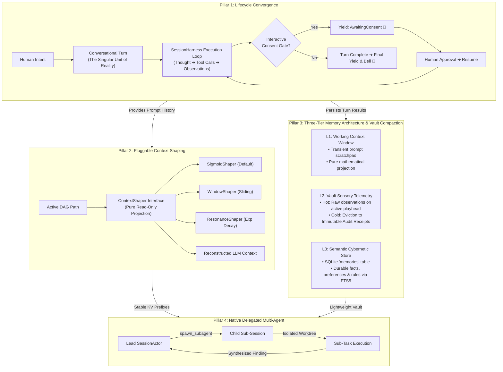

# 🦉 Please v0.3.0 Roadmap: Unified Execution Lifecycle & Memory Architecture

## 1. Executive Summary & Strategic Intent

Through versions `v0.1.x` and `v0.2.x`, `Please` established robust systems foundations:
* In-memory DAG graph models and SQLite WAL persistence ([ADR 002](../decisions/002-graph-sqlite-storage.md), [ADR 010](../decisions/010-pure-dag-graph-extraction.md)).
* Multi-session daemon streaming and Git worktree isolation ([ADR 007](../decisions/007-multi-session-daemon-branch-concurrency.md)).
* Agent Client Protocol (ACP) for IDE integration ([ADR 012](../decisions/012-agent-client-protocol-support.md)).
* Cybernetic memory tools and FTS5 indexing ([ADR 014](../decisions/014-persistent-agent-memory-and-cybernetic-recall.md)).
* Bubble Tea ViewStack focus architecture ([ADR 017](../decisions/017-tui-viewstack-and-hierarchical-focus-architecture.md)).
* Four-tier domain package stratification ([ADR 018](../decisions/018-package-stratification-and-domain-decoupling.md)).

While these modular extractions successfully decoupled packages and stabilized concurrency, the platform accumulated **dual execution paths** and **unbounded sensory persistence** as it rapidly expanded to support standalone TUI operation, multi-client daemon streaming, and IDE protocols:
1. **Execution Path Divergence**: The TUI and headless daemon maintained separate tool-dispatching, streaming, and state management loops rather than the TUI acting as a pure, reactive presentation layer over `SessionHarness`.
2. **Sensory Telemetry Bloat**: Transient host perception (large file reads, verbose command stdout) is persisted indefinitely in SQLite rows without a retention policy, treating temporary perception as immutable historical fact.
3. **Ad-Hoc Agent Coordination**: Multi-agent exploration remains reliant on external shell scripting rather than native, structured sub-session delegation.

**The Purpose of v0.3.0**: Move from dual-maintenance friction to architectural convergence under four sequentially ordered pillars.

### The North Star: A Self-Hosting Development Partner
The ultimate litmus test for v0.3.0 is **dogfooding and trust on local hardware**. By the conclusion of this milestone, the `please` harness and local model execution stack (running on standard developer hardware) must be fast, stable, and memory-efficient enough to make meaningful, regular contributions to the `please` repository itself: performing workspace indexing, codebase research, architectural inspection, and surgical code refactors directly alongside the developer.

---

## 2. The Four Architectural Pillars

The four pillars are sequenced along their causal dependencies: unifying execution first, stabilizing prompt projections second, compacting storage third, and composing multi-agent sessions last.



---

### Pillar 1: Execution Lifecycle Convergence (The Unified Conversational Turn)

#### The Problem
The codebase currently suffers from **accidental duplication of the execution loop**:
1. The interactive TUI maintains its own tool-dispatching state machine (`executeToolsCmd`, `PendingToolCalls`, and `InterleavingNodeID` in `tools_handlers.go`).
2. The engine daemon runs an independent execution loop in `SessionHarness`.
3. Historical nodes hack in-flight execution state into metadata (`segments`), while old `RoleTool` node paths linger from earlier prototypes.

Attempting to invent a heavy new domain noun (like formalizing a `Step` entity) would only create new semantic friction and drag another swath of code along for the ride.

#### The Architectural Contract
v0.3.0 recognizes that **the Conversational Turn is the singular unit of conversational reality**:
* **The Turn Invariant**: A Turn is initiated when an actor speaks (`RoleUser`). The model performs whatever work is necessary—thinking, calling tools, receiving telemetry, and synthesizing answers—until it yields control back to the human.
* **Elimination of Parallel Runners**:
  * Retire the separate tool-dispatching loop in the TUI (`tools_handlers.go`).
  * Make `SessionHarness` the **single authoritative execution runner** across all modes (standalone TUI, headless daemon, and ACP).
  * The TUI becomes a pure reactive consumer of harness events (`token`, `thought`, `tool_call`, `tool_result`, `yield`).
* **Clean State Transitions (Phonic Staging)**:
  * A Turn moves through clean, observable states:
    $$\text{State}_{\text{Running}} \longrightarrow \text{State}_{\text{AwaitingConsent}} \text{ (Interactive Yield 🔔)} \longrightarrow \text{State}_{\text{Running}} \longrightarrow \text{State}_{\text{Completed}} \text{ (Terminal Yield 🔔)}$$
  * Acoustic bells and UI yields fire strictly when human attention is required, never during autonomous tool loops.
* **Zero Metadata Segment Hacks**: Assistant nodes cleanly represent the completed conversational turn without synthetic JSON string slicing in node metadata.

---

### Pillar 2: Pluggable Context Shaping (`ContextShaper`)

#### The Problem
The current Context Resonance algorithm ([docs/context_resonance.md](context_resonance.md)) hardcodes an exponential decay formula directly into `service.go`. More critically, it suffers from three structural flaws:
1. **The Wall-Clock Flaw ("Lunch Break Amnesia")**: The formula relies on $\Delta t = \text{time.Since(node.Timestamp)}$. Walking away for a 45-minute lunch or resuming a session the next day aggressively decays the conversation's resonance score, despite zero tokens or tool calls having occurred.
2. **The "Shivering Token" KV-Cache Invalidation**: Because $\Delta t$ and floating-point scores fluctuate continuously, older node token counts continuously shift across turns. This invalidates prefix-based KV caches (Ollama/llama.cpp, vLLM, OpenAI prompt caching), forcing full prompt re-computation on every single turn.
3. **Symmetric Decay on Asymmetric Data**: Tool observations and spoken dialogue have radically different entropy curves. Tool outputs are transient telemetry that should drop off a steep cliff to lightweight receipts. Spoken dialogue (`node.Content`) contains user objectives and conversational contracts; decaying it exponentially to zero causes the model to lose its original grounding.

#### The Architectural Contract
v0.3.0 completely retires wall-clock time from context shaping, relying exclusively on **Topological / Step Distance ($\Delta d$)** and **Token Capacity Pressure (Fill Ratio)**.

Prompt construction is decoupled from storage by introducing the `ContextShaper` interface:

```go
type ContextShaper interface {
    // ShapeContext filters, compacts, and formats DAG nodes into a cache-stable LLM prompt sequence
    ShapeContext(ctx context.Context, path []*graph.Node, budget int) ([]domain.Message, error)
}
```

#### Monotonic Prefix Invariance (KV-Cache Optimization)
To guarantee near-instant prefill and stable prompt caching:
* **PINNED Genesis Root**: System prompt (`RoleSystem`) and initial user goal nodes are pinned at 100% fidelity. Token prefix $0 \dots N$ is invariant.
* **The Frozen Asymptote (Stable Floor)**: As historical nodes age out of the active window, they settle onto a discrete, deterministic baseline representation. **Once a node hits this floor, its rendered text is frozen**—it never shrinks by further characters on subsequent turns, keeping the token prefix cache-valid.
* **Active Working Window**: Only the newest turns at the tail of the DAG mutate, ensuring that only new tokens are prefilled by the inference engine.

#### Standard Shaper Implementations (`sigmoid | window | exponential`)
Configurable via `ClientConfig` / `ServerConfig` (`context_shaper: "sigmoid" | "window" | "exponential"`):

1. **`sigmoid` (Recommended Default)**:
   * Uses an S-curve: $S(d) = \frac{1}{1 + e^{k(d - d_0)}}$ with an active plateau (100% fidelity for recent turns), smooth transition horizon, and a stable non-zero floor.
   * Eliminates abrupt sliding-window cliffs while preserving full context on immediate iterations.
2. **`window`**:
   * Classical $K$-turn sliding window.
   * Maximum predictability and zero mathematical overhead; optimal for low-memory local models.
3. **`exponential` (Legacy Resonance Refactored)**:
   * Refactored version of the original resonance formula, stripped of wall-clock time and driven strictly by topological step distance ($\Delta d$) and token fill ratio.

> [!NOTE]
> **Why `compact` is NOT a `ContextShaper`**: Compaction (Supernodes & memory harvesting via `CompactRangeWithDirective`) is a **graph-mutating lifecycle event** (Pillar 3) that writes to SQLite `nodes` and `memories`. In contrast, `ContextShaper` is strictly a **pure, read-only projection** ($\text{DAG Path} \longrightarrow \text{Messages}$). Shapers project whatever the graph contains—including pre-existing `RoleSummary` Supernodes—with zero side effects or storage mutations.

---

### Pillar 3: Three-Tier Memory Architecture & Vault Compaction

#### The Problem
Pillar 3 is where the bulk of real-world tokens and performance degradation land. Currently, reading a 100 KB file writes 100 KB into SQLite `nodes.observations` forever. A 20-turn session can inflate the database to 50x the size of the repository being worked on, turning the SQLite vault into a bloated, immutable duplicate of temporary host filesystem state.

#### The Architectural Contract
v0.3.0 establishes an explicit, three-tier memory hierarchy that cleanly separates transient perception from permanent recall:

| Tier | Name | Storage Subsystem | Mutability & Lifecycle | Purpose |
| :--- | :--- | :--- | :--- | :--- |
| **L1** | **Working Context Window** | RAM / In-Flight Prompt Buffer | Reconstructed per generation; ephemeral | The immediate attention span fitted to `num_ctx` via pure mathematical projection. |
| **L2** | **Sensory Observation Vault** | SQLite `nodes` + `observation_blobs` | Out-of-band blobs + in-DAG Smart Receipts | Operational audit trail, causal replay, and on-demand telemetry paging via virtual pointers. |
| **L3** | **Cybernetic Semantic Store** | SQLite `memories` table | Durable, explicit UPSERT, FTS5 indexed | Long-term knowledge, user preferences, and workspace architectural constraints. |

#### L2 Sensory Storage, Smart Receipts & Virtual Paging
To maximize forward generative runway, keep the SQLite vault lightweight, and preserve cache prefill:
* **The Smart Receipt Contract**: In-context prompt sequences carry only deterministic receipts:
  ```json
  {
    "receipt_id": "obs_94a2f8b1",
    "tool": "execute_command",
    "command": "go test ./...",
    "exit_code": 1,
    "lines": 142,
    "bytes": 8420,
    "summary": "142 lines, 3 test failures",
    "banner": "FAIL: TestSessionHarness_Compaction (0.12s)",
    "has_blob": true
  }
  ```
* **Out-of-Band Retention**: Host file reads point to disk; transient command telemetry is compressed and stored out-of-band in `observation_blobs`.
* **On-Demand Paging (`inspect_receipt`)**: If an agent needs to examine exact traces or assertion lines from a past receipt, it invokes `inspect_receipt(receipt_id="obs_94a2f8b1")` to page matching lines into its *current* forward turn—eliminating intermediate token tax without irreversible data loss.

---

### Pillar 4: Native Delegated Multi-Agent Topologies

#### The Problem
Multi-agent operations are currently only achievable via external shell orchestration. External scripts lack parent-child DAG tracking, cannot share memory scopes safely, and cannot return structured observations directly into an active reasoning loop.

#### The Architectural Contract
v0.3.0 elevates multi-agent capabilities to a first-class internal engine feature:
* **The Delegation Tool (`spawn_subagent`)**:
  * An assistant turn can invoke a native delegation tool with a structured goal, session label, and tool permissions.
* **Sub-Session Actor Provisioning**:
  * The daemon provisions a child [`SessionActor`](../internal/server/session_actor.go) with its own isolated Git worktree ([ADR 007](../decisions/007-multi-session-daemon-branch-concurrency.md)).
  * **Execution Lifecycle (Single Turn, Bounded Steps)**: By default, delegated subagents execute as a **single Turn** seeded by the task prompt (`RoleUser`). Autonomous iteration within that turn is bounded strictly by a **Step Limit** (`max_steps`, formalizing the previously overloaded `maxDepth` loop), terminating when the model yields with no further tool calls or exhausts its step budget.
  * *(Future Extension: Synthetic Multi-Turn Loops)*: Multi-turn subagent execution (bounded by a separate `turn_limit`) is reserved for supervisor/evaluator topologies where an automated harness injects synthetic follow-up turns (e.g., test-failure reflexion loops or parent-child clarification dialogue).
* **Structured Perception Feedback**:
  * The child session's final synthesis is returned to the parent agent as a `ToolObservation`.
  * The parent agent never ingests the raw intermediate trial-and-error noise of the subagent's internal Steps, preserving parent context tokens.
* **Memory Hierarchy Scoping**:
  * Child sessions read from `ScopeWorkspace` memories, but isolate private hypotheses to `ScopeSession`.
  * Promoted findings can be committed back to `ScopeWorkspace`.

---

## 3. Milestones & Delivery Phases

### Phase 1: Lifecycle Convergence & Canonical Harness Standardization
* [ ] **RFC / [ADR 019](../decisions/019-lifecycle-convergence-and-canonical-harness-standardization.md)**: Consolidate the Conversational Turn onto `SessionHarness` as the singular execution pipeline.
* [ ] Retire redundant tool-dispatching loops in the TUI (`executeToolsCmd`, `tools_handlers.go`), transforming Bubble Tea into a pure reactive consumer of harness events.
* [ ] Eliminate in-flight metadata segment hacking (`node.Metadata["segments"]`) and unify observation pairing.
* [ ] Verify 100% test passage across interactive TUI, headless daemon, and ACP execution surfaces.

### Phase 2: Cache-Stable Context Shaping & Pure Prompt Projections
* [ ] **RFC / [ADR 020](../decisions/020-cache-stable-context-shaping-and-pure-prompt-projections.md)**: Formalize the pure read-only `ContextShaper` interface and monotonic prefix stability rules.
* [ ] Extract `ContextShaper` interface into `internal/engine/shaper.go` and implement `SigmoidShaper`, `WindowShaper`, and `ResonanceShaper` (refactored without wall-clock time).
* [ ] Add configuration hooks for selectable context shapers (`context_shaper: "sigmoid" | "window" | "exponential"`).
* [ ] Benchmark KV-cache prefix retention across Ollama and local backends.

### Phase 3: Observation Compaction & Vault Hygiene
* [ ] **RFC / [ADR 021](../decisions/021-tiered-sensory-storage-and-observation-compaction.md)**: Define Observation Receipt schema, out-of-band telemetry blobs, and addressable observation paging.
* [ ] Implement `CompactNodeObservations` in `SQLiteStorage` with content-hash receipt generation.
* [ ] Connect observation compaction to the background GC cycle (`please gc`) and `/compact` commands.
* [ ] Add telemetry metrics to `please inspect` showing raw vs. receipt byte savings.

### Phase 4: First-Class Sub-Session Delegation
* [ ] **RFC / [ADR 022](../decisions/022-native-delegated-multi-agent-topologies.md)**: Define the Delegated Agent Protocol, worktree sandboxing, and tool specification.
* [ ] Implement `spawn_subagent` tool in `internal/tools/delegate.go`.
* [ ] Wire subagent provisioning through `SessionHarness` and daemon `SessionActor` registry.
* [ ] Validate end-to-end multi-agent living scenarios in `internal/engine/scenarios_test.go` ([ADR 015](../decisions/015-living-scenarios-and-test-subsystem-decomposition.md)).

---

## 4. Architectural Verification & Quality Standards

Every phase in the v0.3.0 roadmap must conform to the project's established conventions:
* **The Bootstrapping Litmus Test**: The local model execution stack (Ollama / local inference) must successfully perform indexing, research, and surgical code edits directly against the `please` repository without context exhaustion or state corruption.
* **Hermetic Fast Tests**: All unit tests run in `< 2s` with `go test -count=1 ./...`.
* **Zero Cross-Tier Coupling**: Respect the 4-tier stratification in [ADR 018](../decisions/018-package-stratification-and-domain-decoupling.md) (Domain $\rightarrow$ Infra $\rightarrow$ Engine $\rightarrow$ Presentation).
* **Deterministic Replay**: `please context` and `please inspect` must continue to provide 100% transparent prompt auditability.
* **Living Scenarios**: Multi-agent delegation must be accompanied by living scenarios under `ADR 015` avoiding mock drift.
