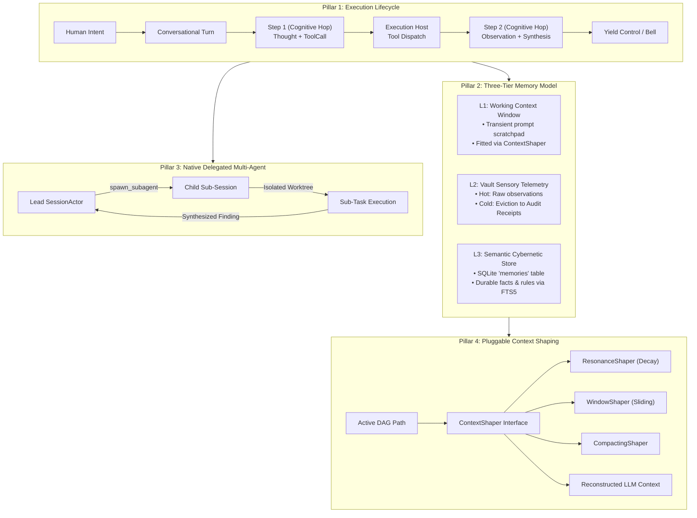

# 🦉 Please v0.3.0 Roadmap: Unified Execution Lifecycle & Memory Architecture

## 1. Executive Summary & Strategic Intent

Through versions `v0.1.x` and `v0.2.x`, `Please` established robust systems foundations:
* In-memory DAG graph models and SQLite WAL persistence ([ADR 002](../decisions/002-graph-sqlite-storage.md), [ADR 010](../decisions/010-pure-dag-graph-extraction.md)).
* Multi-session daemon streaming and Git worktree isolation ([ADR 007](../decisions/007-multi-session-daemon-branch-concurrency.md)).
* Agent Client Protocol (ACP) for IDE integration ([ADR 012](../decisions/012-agent-client-protocol-support.md)).
* Cybernetic memory tools and FTS5 indexing ([ADR 014](../decisions/014-persistent-agent-memory-and-cybernetic-recall.md)).
* Bubble Tea ViewStack focus architecture ([ADR 017](../decisions/017-tui-viewstack-and-hierarchical-focus-architecture.md)).
* Four-tier domain package stratification ([ADR 018](../decisions/018-package-stratification-and-domain-decoupling.md)).

While these tactical extractions successfully decoupled packages and stabilized concurrency, development has recently experienced friction characterized by **"meandering intent"**—encountering surface-level bugs that unravel into deeper refactors.

### The Root Cause
The core domain model has outgrown its original implicit assumptions. Specifically, three concepts have been conflated across the engine:
1. **The Turn Boundary**: The code uses "turn" interchangeably to describe an individual LLM round-trip, an intermediate tool invocation, and an entire human-to-agent conversational exchange.
2. **Context vs. Memory**: The system currently writes 100% of raw sensory tool outputs (e.g. 50 KB file reads or verbose command stdout) into immutable SQLite rows forever, treating transient perception as permanent history while forcing prompt decay algorithms to masquerade as memory management.
3. **Agentic Workflows**: Multi-agent scenarios are technically possible via external scripts calling the CLI, but lack first-class engine representation, parent-child DAG lineage, and structured perception delegation.

**The Purpose of v0.3.0**: Move from reactive bug-driven refactoring to proactive domain alignment under four unified architectural pillars.

---

## 2. The Four Architectural Pillars



---

### Pillar 1: Formal Execution Lifecycle (The Step vs. The Turn)

#### The Problem
The engine currently blurs the boundary between single LLM predictions and composite user interactions. This forces complex workarounds like mutating assistant nodes in-place (`UpdateAssistantObservations`), tracking `InterleavingNodeID` in TUI state, and ambiguity in acoustic bell timing.

#### The Architectural Contract
v0.3.0 formally separates the hierarchy into two explicit domain primitives:
* **Step (Cognitive Hop)**: The atomic unit of model execution.
  * Inputs: Reconstructed context history.
  * Execution: Model streams tokens, optional thinking block, and optional `ToolCalls`.
  * Outputs: Intermediate state appended to the turn.
* **Turn (Conversational Unit)**: The outer lifecycle initiated by a user or upstream actor.
  * Comprises `1..N` sequential Steps.
  * Bounded by a configurable max step limit or explicit yield condition (`TurnComplete` or interactive human-in-the-loop gate).
  * State lifecycle: `Pending` $\rightarrow$ `Stepping` $\rightarrow$ `AwaitingConsent` $\rightarrow$ `Completed`.
  * Acoustic telemetry ([ADR 013](../decisions/013-acoustic-theatrics-phonic-staging-and-talon-tap-telemetry.md)) and session head updates fire strictly on Turn boundaries, never intermediate Step transitions.

---

### Pillar 2: Three-Tier Memory Architecture (Perception vs. Recall)

#### The Problem
Currently, reading a 100 KB file writes 100 KB into SQLite `nodes.observations` forever. A 20-turn session can inflate the database to 50x the size of the repository being worked on. We are keeping a 1:1 copy of temporary host filesystem state in an append-only transaction ledger.

#### The Architectural Contract
v0.3.0 establishes an explicit three-tier memory model:

| Tier | Name | Storage Subsystem | Mutability & Lifecycle | Purpose |
| :--- | :--- | :--- | :--- | :--- |
| **L1** | **Working Context Window** | RAM / In-Flight Prompt Buffer | Reconstructed per Step; ephemeral | The immediate attention span fitted to `num_ctx`. |
| **L2** | **Sensory Observation Vault** | SQLite `nodes.observations` | Tiered retention: Hot $\rightarrow$ Cold (Receipts) | Operational audit trail and replay history. Distant ancestors decay into lightweight **Observation Receipts**. |
| **L3** | **Cybernetic Semantic Store** | SQLite `memories` table | Durable, explicit UPSERT, FTS5 indexed | Long-term knowledge, user preferences, and workspace architectural constraints. |

#### L2 Observation Compaction (Decay at Rest)
* **Hot Tier (Recent turns / Active Playhead)**: Full raw observation telemetry retained to allow exact context reconstruction during active iterations.
* **Cold Tier (Ancestor turns beyond resonance grace horizon)**: Replaced with compact **Observation Receipts**:
  ```json
  {
    "tool": "read_file",
    "path": "internal/engine/service.go",
    "summary": "Read lines 1-250 (9.2 KB, hash: e3b0c442)",
    "bytes": 9420,
    "lines": 250,
    "retained_excerpt": "package engine..."
  }
  ```
* Dramatically reduces SQLite vault growth while keeping replay and lineage verification 100% intact.

---

### Pillar 3: Native Delegated Multi-Agent Topologies

#### The Problem
Multi-agent operations are currently only achievable via external shell orchestration. External scripts lack parent-child DAG tracking, cannot share memory scopes safely, and cannot return structured observations directly into an active reasoning loop.

#### The Architectural Contract
v0.3.0 elevates multi-agent capabilities to a first-class internal engine feature:
* **The Delegation Tool (`spawn_subagent`)**:
  * An assistant turn can invoke a native delegation tool with a structured goal, session label, and tool permissions.
* **Sub-Session Actor Provisioning**:
  * The daemon provisions a child [`SessionActor`](../internal/server/session_actor.go) with its own isolated Git worktree ([ADR 007](../decisions/007-multi-session-daemon-branch-concurrency.md)).
  * **Execution Lifecycle (Single Turn, Bounded Steps)**: By default, delegated subagents execute as a **single Turn** seeded by the task prompt (`RoleUser`). Autonomous iteration within that turn is bounded strictly by a **Step Limit** (`max_steps`, formalizing the previously overloaded `maxDepth` loop), terminating when the model yields with no further tool calls or exhausts its step budget.
  * *(Future Extension: Synthetic Multi-Turn Loops)*: Multi-turn subagent execution (bounded by a separate `turn_limit`) is reserved for supervisor/evaluator topologies where an automated harness injects synthetic follow-up turns (e.g., test-failure reflexion loops or parent-child clarification dialogue).
* **Structured Perception Feedback**:
  * The child session's final synthesis is returned to the parent agent as a `ToolObservation`.
  * The parent agent never ingests the raw intermediate trial-and-error noise of the subagent's internal Steps, preserving parent context tokens.
* **Memory Hierarchy Scoping**:
  * Child sessions read from `ScopeWorkspace` memories, but isolate private hypotheses to `ScopeSession`.
  * Promoted findings can be committed back to `ScopeWorkspace`.

---

### Pillar 4: Pluggable Context Shaping (`ContextShaper`)

#### The Problem
The current Context Resonance algorithm ([docs/context_resonance.md](context_resonance.md)) hardcodes an exponential decay formula directly into `service.go`. Exploring alternative decay functions or fixed-window strategies requires branch forks (`kbartley/pluggable-decay`) and risky engine modifications.

#### The Architectural Contract
v0.3.0 decouples prompt construction from storage by introducing the `ContextShaper` interface:

```go
type ContextShaper interface {
    // ShapeContext filters, compacts, and formats DAG nodes into an LLM prompt sequence
    ShapeContext(ctx context.Context, path []*graph.Node, budget int) ([]domain.Message, error)
}
```

* **Standard Implementations**:
  1. `ResonanceShaper`: The existing exponential token-decay algorithm with dynamic capacity zones.
  2. `SlidingWindowShaper`: Classical $K$-turn sliding window for predictable token constraints.
  3. `SummaryCompactingShaper`: Aggressively summarizes ancestor turns into compact synthesis blocks.
* Configurable via `ClientConfig` / `ServerConfig` (`context_shaper: "resonance" | "window" | "compact"`).

---

## 3. Milestones & Delivery Phases

### Phase 1: Lifecycle Formalization & Pluggable Context Shaping
* [ ] **RFC / ADR 019**: Formalize the Step vs. Turn execution model and `ContextShaper` interface.
* [ ] Extract `ContextShaper` interface into `internal/engine/shaper.go` and implement `ResonanceShaper`.
* [ ] Deprecate in-place observation mutation in favor of formal Step progression in `SessionHarness`.
* [ ] Add configuration hooks for selectable context shapers.

### Phase 2: Observation Compaction & Vault Hygiene
* [ ] **RFC / ADR 020**: Define Observation Receipt schema and vault compaction mechanics.
* [ ] Implement `CompactNodeObservations` in `SQLiteStorage` with content-hash receipt generation.
* [ ] Connect observation compaction to the background GC cycle (`please gc`) and `/compact` commands.
* [ ] Add telemetry metrics to `please inspect` showing raw vs. receipt byte savings.

### Phase 3: First-Class Sub-Session Delegation
* [ ] **RFC / ADR 021**: Define the Delegated Agent Protocol and tool specification.
* [ ] Implement `spawn_subagent` tool in `internal/tools/delegate.go`.
* [ ] Wire subagent provisioning through `SessionHarness` and daemon `SessionActor` registry.
* [ ] Validate end-to-end multi-agent living scenarios in `internal/engine/scenarios_test.go` ([ADR 015](../decisions/015-living-scenarios-and-test-subsystem-decomposition.md)).

---

## 4. Architectural Verification & Quality Standards

Every phase in the v0.3.0 roadmap must conform to the project's established conventions:
* **Hermetic Fast Tests**: All unit tests run in `< 2s` with `go test -count=1 ./...`.
* **Zero Cross-Tier Coupling**: Respect the 4-tier stratification in [ADR 018](../decisions/018-package-stratification-and-domain-decoupling.md) (Domain $\rightarrow$ Infra $\rightarrow$ Engine $\rightarrow$ Presentation).
* **Deterministic Replay**: `please context` and `please inspect` must continue to provide 100% transparent prompt auditability.
* **Living Scenarios**: Multi-agent delegation must be accompanied by living scenarios under `ADR 015` avoiding mock drift.
